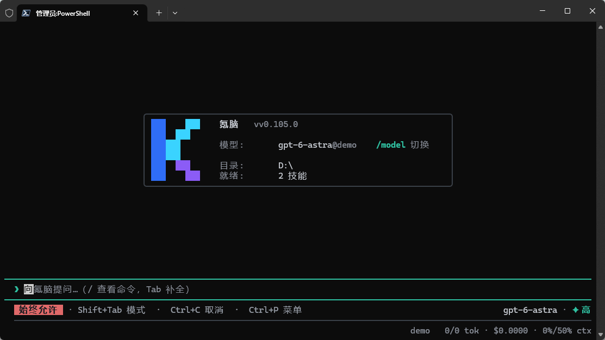

<div align="center">

# K-brain · 氪脑

**A terminal coding agent built in Go, with a reusable backend for other frontends.**

Read code, edit files, run commands, and verify results in one session.

Start with **`kn`**, short for **K**e **N**ao, the Chinese name 氪脑.

[](go.mod)
[](https://github.com/Stack-Cairn/K-brain/releases)
[](LICENSE)

[简体中文](README.zh-CN.md) · **English**

[Quickstart](#quickstart) · [Usage](#usage) · [Building from source](#building-from-source) · [Documentation](#documentation) · [Repository layout](#repository-layout)

<p align="center">
  
</p>

</div>

---

## Quickstart

### 1. Install

**macOS / Linux**

```sh
curl -fsSL https://raw.githubusercontent.com/Stack-Cairn/K-brain/main/install.sh | sh
```

**Windows PowerShell**

```powershell
& ([scriptblock]::Create((Invoke-WebRequest -UseBasicParsing https://raw.githubusercontent.com/Stack-Cairn/K-brain/main/install.ps1).Content))
```

The installers download platform binaries from [GitHub Releases](https://github.com/Stack-Cairn/K-brain/releases) and verify SHA-256 checksums. Windows installs to `%LOCALAPPDATA%\Programs\k-brain` by default; open a new terminal for PATH changes to take effect. If a suitable release is not available, [build from source](#building-from-source).

<details>
<summary>Manual downloads: Windows, Linux, macOS × x64, ARM64</summary>

Main assets are named `k-brain-<os>-<arch>`, with `.exe` on Windows. `os` is `windows`, `linux`, or `darwin`; `arch` is `x64` or `arm64`. Rename the main binary to `kn` (`kn.exe` on Windows), put it on PATH, and make it executable on Linux/macOS.

For computer-use, rename `k-brain-computer-<os>-<arch>` to `k-brain-computer` (with `.exe` on Windows) and place it beside the main binary. See [Platform notes](#platform-notes) for runtime dependencies.

</details>

### 2. Configure an API

Edit `~/.k-brain/config.json`, or `$HOME\.k-brain\config.json` on Windows. The file supports JSONC comments and trailing commas. Set `K_BRAIN_HOME` to use another configuration directory.

```json
{
  "language": "en",
  "defaultModel": "model1",
  "providers": {
    "demo": {
      "name": "demo",
      "api": "openai-completions",
      "baseUrl": "https://api.example.com/v1",
      "apiKey": "YOUR_API_KEY",
      "models": [
        {"id": "model1", "contextWindow": 128000, "maxTokens": 8192},
        {"id": "model2", "contextWindow": 128000, "maxTokens": 8192}
      ]
    }
  }
}
```

Replace `baseUrl`, `apiKey`, `model1`, and `model2` with your provider's values. K-brain supports third-party API-key connections only, with no built-in account login, OAuth, or subscription authentication.

| `api` | Protocol |
| --- | --- |
| `openai-completions` | OpenAI Chat Completions |
| `openai-responses` | OpenAI Responses |
| `anthropic-messages` | Anthropic Messages |

- Use an API prefix such as `https://api.example.com/v1` for `baseUrl`, not a complete `/chat/completions` endpoint.
- Declare models inside each provider's `models` array. The legacy top-level `models` format is not supported.
- `contextWindow` is the context token limit; `maxTokens` is the output token limit. Set them to the model's actual limits. Explicit configuration takes precedence over the model catalog.
- `/model refresh` fetches `baseUrl + "/models"`, which is `/v1/models` in this example. Use `/model` to select a model.
- Restart after editing the file. The TUI can open without API credentials, but model requests require a valid configuration.

Optional lifecycle hooks can run a local command for an agent event. The command receives a JSON event in `K_BRAIN_HOOK_EVENT`; a non-zero `PreToolUse` hook denies that tool call.

```json
{
  "hooks": {
    "SessionStart": [{"command": "echo session started"}],
    "PreToolUse": [{"command": "echo $K_BRAIN_HOOK_EVENT", "shell": "bash", "timeout": 10}]
  }
}
```

Supported events are `SessionStart`, `UserPromptSubmit`, `PreToolUse`, `PostToolUse`, and `Stop`. Hooks use the configured shell on Windows (`powershell`, `pwsh`, `bash`, `wsl`, or `cmd`) and the platform shell elsewhere.

### Session files

Sessions live under `~/.k-brain/sessions/<project-id>/<session-id>/session.jsonl` (or `$K_BRAIN_HOME/sessions`). Project IDs are stable hashes of the workspace path, keeping sessions grouped by project while exposing each full session ID.

```text
~/.k-brain/
  config.json
  brain.md
  sessions/<project-id>/<session-id>/session.jsonl
    <session-id>/
      session.jsonl
```

Run `kn sessions` to list project-grouped session IDs. Use `kn sessions search <query>`, `kn sessions archive <id>`, or `kn sessions delete <id>` for navigation. Resume with `kn --resume <session-id>`; `/status` shows the current session file. Persistent standing instructions are stored in `~/.k-brain/brain.md` and edited with `/brain`. JSONL records include metadata, messages, tasks, compactions, schedules, and rewind snapshot references. SQLite storage and migration are no longer supported; existing database files are not read or modified.

Project trust decisions use TOML at `~/.k-brain/trusted_folders.toml` (Windows: `~\.k-brain\trusted_folders.toml`), with one `[folders."<absolute-path>"]` table containing `trusted` and `decided_at` fields.

### OS sandbox

Configure command isolation in `config.json`:

```json
{"sandbox":{"mode":"strict","backend":"auto","network":false,"writable":[],"readOnly":[]}}
```

Linux uses Bubblewrap namespaces, macOS uses Seatbelt, and Windows uses WSL2 plus Bubblewrap (`backend: "wsl"`). Strict mode fails closed when its backend is unavailable. Shell, plugin, and background tools inherit the policy.

### Plugins

Put a plugin manifest at `.k-brain/plugins/<name>/plugin.json` or `~/.k-brain/plugins/<name>/plugin.json`:

```json
{"name":"sample","version":"1.0.0","command":["sample-plugin"],"prompt":"Additional instructions","tools":[{"name":"lookup","description":"Look up a value","inputSchema":{"type":"object"}}]}
```

The process receives one JSONL `tool.invoke` request and returns one JSON-RPC response. Plugins are explicitly enabled and inherit the sandbox. Manage them with `kn plugins list|install|enable|disable|remove|reload` or `/plugins`.

### 3. Start a task

Run this in your project directory:

```sh
kn
```

Describe the task directly:

```text
Read this project, find the cause of the failing tests, fix it, run the relevant tests, and summarize the changes.
```

The TUI uses a full-screen terminal view with a bottom-anchored input area. The session title appears at the bottom right after the first turn. Use `kn -c` to continue the latest session in the current directory, or `kn --resume` to open the session picker.

## Usage

### Interactive sessions

| Input | Action |
| --- | --- |
| `/language` · `/language zh_cn` · `/language zh_Hant` · `/language en` | Choose the interface language (Simplified Chinese / Traditional Chinese / English) |
| `/model` · `/effort` | Switch models and adjust reasoning effort |
| `/context` · `/compact` | Inspect context and compact it manually |
| `/rewind` · `/fork` | Rewind to an earlier turn or branch a session |
| `/forks` · `/export` · `/import` | Show the session tree, export Markdown/JSONL/HTML, or import JSONL |
| `/title` · `/resume` | Rename or resume a session |
| `/diff [--staged] [--stat]` | Inspect tracked Git changes locally, without a model request |
| `/copy [N] [file]` | Copy the Nth latest assistant message with text, or save it to a new file |
| `/prompts [refresh]` | List or reload Markdown prompt templates |
| `/mcp` · `/tasks` | Manage MCP connections and inspect background tasks |
| `!command` · `!!command` | Run a shell command; the first adds output to the conversation, the second stays local |
| `/help` | Show all commands and keyboard shortcuts |

Use `Ctrl+P` for the command palette, `Ctrl+J` for a newline, `Esc` to interrupt the current task, and `PgUp/PgDn` to scroll. Launch with `kn -cautious` to request confirmation before commands or file writes.

<details>
<summary>Markdown prompt templates</summary>

Put global templates in `~/.k-brain/prompts/` and project templates in a trusted project's `.k-brain/prompts/`. Discovery is non-recursive. Project templates override global templates of the same name; built-in commands take precedence.

Example `audit.md`:

```markdown
---
description: Review a module
argument-hint: "<module> [focus]"
---
Review $1, focusing on ${2:-correctness and test coverage}.
Additional requirements: ${@:3}
```

Run `/prompts refresh`, then enter `/audit "internal/agent" "concurrency"`. The template expands into the input area; press Enter again to send it.

Supported substitutions: `$1`, `$2`, `$@`, `$ARGUMENTS`, `${1:-default}`, `${@:-default}`, `${ARGUMENTS:-default}`, `${@:N}`, and `${@:N:L}`. Arguments accept single or double quotes. Templates do not perform shell or environment-variable expansion. Metadata supports simple single-line fields, not full YAML. Files are limited to 1 MiB.

</details>

### Interface language

Run `/language` to open the language picker, then use ↑/↓ and Enter to apply or Esc to cancel. `/language zh_cn`, `/language zh_Hant`, and `/language en` switch directly and save `language` to `~/.k-brain/config.json`. English is the default; unknown values fall back to English.

`/export` chooses Markdown (`.md`), structured JSONL (`.jsonl`), or HTML (`.html`) from the file extension. `/import <path>` appends messages from a JSONL transcript, and `/forks` shows the current session and its fork relationships.

The slash-command descriptions, help, input hints, primary navigation labels, and language/model picker controls switch immediately. Command names, model/provider identifiers, conversation content, and tool output remain unchanged. This setting does not instruct the model to reply in a specific language; some detailed diagnostics and secondary panels still use English.

### External prompt editor

Press `Ctrl+G` to edit the current draft, or `/editor` to start a new prompt in an external editor. K-brain uses `VISUAL`, then `EDITOR`, falling back to `notepad.exe` on Windows or `vi` on Linux/macOS. Commands accept quoted paths and arguments, such as `code --wait`; shell expressions are not expanded. Save and close the editor to return to the TUI, then press Enter to send. Editing is disabled during an active turn. Failed or oversized edits are retained in a temporary file for recovery.

### Headless use and backend integration

```sh
kn run "Explain this project's structure"
git diff | kn run "Review these changes"
kn run --format json --quiet --max-turns 8 --timeout 5m "Find and fix the build failure"
```

`--format json` emits newline-delimited JSON events (NDJSON), not one JSON document.

| Entry point | Purpose |
| --- | --- |
| `kn acp` | Connect ACP editors over standard input/output |
| `kn mcp serve` | Expose built-in file and command tools to other clients |
| `kn sessions` | List saved sessions |
| `kn update` | Update the installed version |

The execution core is separate from the TUI and shares model adapters, tool loops, context compaction, background subtasks, and JSONL session files. Current backend entry points are CLI, ACP, and MCP—not a standalone HTTP service. This repository does not include a Desktop frontend.

### Platform notes

- **Windows shell**: prefers PowerShell 7, falling back to Windows PowerShell. Set `K_BRAIN_SHELL` to `pwsh`, `powershell`, `bash`, `wsl`, `cmd`, or an executable path. Native Windows does not support Unix-style interactive PTY forwarding.
- **Computer-use**: Windows uses PowerShell/UIA, macOS uses Python/PyObjC, and Linux uses Python/AT-SPI2. Linux X11 has GTK/Xvfb integration coverage. macOS awaits real-desktop validation; a general Wayland desktop-input portal is not implemented. See the runtime setup below.

Computer-use runtime setup: Windows uses the built-in PowerShell. macOS requires Accessibility and Screen Recording permissions for the terminal/interpreter. Linux requires an active graphical session with DISPLAY and D-Bus. Set `K_BRAIN_COMPUTER_BIN` to override the helper path.

```sh
# macOS
python3 -m venv ~/.k-brain/computer-venv
~/.k-brain/computer-venv/bin/python -m pip install pyobjc-framework-Cocoa pyobjc-framework-Quartz pyobjc-framework-ApplicationServices
export K_BRAIN_COMPUTER_PYTHON="$HOME/.k-brain/computer-venv/bin/python"

# Debian / Ubuntu (X11)
sudo apt-get install python3-pyatspi python3-pil python3-pil.imagetk xdotool
export K_BRAIN_COMPUTER_PYTHON=/usr/bin/python3
```

## Building from source

Requires Git and **Go 1.27+**. The version requirement is recorded in [`go.mod`](go.mod).

```sh
git clone https://github.com/Stack-Cairn/K-brain.git
cd K-brain
go install ./cmd/kn ./cmd/k-brain-computer
```

Ensure Go's binary directory, usually `~/go/bin`, is on PATH. To run or build directly from the repository:

```sh
go run ./cmd/kn
go build -o kn ./cmd/kn
```

On Windows, use `go build -o kn.exe ./cmd/kn`, then `.\kn.exe`. Build or install `cmd/k-brain-computer` separately when using computer-use.

## Documentation

- [Build and release workflow](.github/workflows/build.yml)
- CLI help: `kn --help`, `kn run --help`; TUI help: `/help`

## Repository layout

| Path | Responsibility |
| --- | --- |
| `cmd/kn` | Main binary, TUI, headless execution, and protocol entry points |
| `cmd/k-brain-computer` | Computer-use RPC helper |
| `internal/agent` | Model/tool loop and subtask coordination |
| `internal/ai` · `internal/routing` | Protocol adapters, streaming, and model routing |
| `internal/config` | Configuration, model catalogs, and local settings |
| `internal/tools` | Shell, file access, and editing tools |
| `internal/prompts` · `internal/skills` | Prompts, templates, and skill loading |
| `internal/session` · `internal/memory` | Session persistence and durable memory |
| `internal/mcp` · `internal/acp` · `internal/lsp` | Tool, editor, and language-server protocols |
| `internal/browser` · `internal/computer` | Browser and desktop automation |
| `internal/tui` | Terminal layout, input, and event presentation |

## Development

Start with tests for the changed packages, then run broader checks:

```sh
go test ./internal/computer/... -count=1
go vet ./internal/computer/...
go test ./...
```

Some integration tests need platform tools, a graphical session, or explicit environment opt-ins. A successful build does not imply a passing full test suite. Additional tasks are in [`Taskfile.yaml`](Taskfile.yaml).

The GitHub Actions release workflow runs **only on pushed `v*` tags**. It cross-compiles Windows, Linux, and macOS for x64 / ARM64, generates checksums, and publishes release assets. Ordinary branch pushes do not trigger this workflow.

## References and acknowledgments

K-brain references the architecture and implementation ideas of [context-labs/whip](https://github.com/context-labs/whip/). Its terminal interaction, execution core, and module organization also draw on [OpenAI Codex](https://github.com/openai/codex), [Grok Build](https://x.ai/cli), [Pi](https://github.com/badlogic/pi-mono), and [Claude Code](https://github.com/anthropics/claude-code). This README's organization is inspired by Codex and Grok Build.

K-brain is independently maintained and does not represent those projects or their developers.
## community

[LINUX DO](https://linux.do)

## License

[Apache License 2.0](LICENSE).
